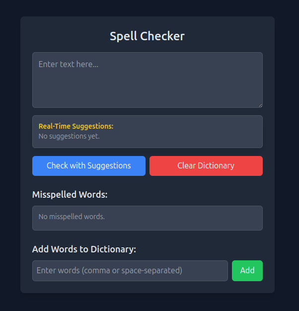

---

# 🔍 **Spell Checker**  

A simple spell-checking web application built with **Laravel**, **Alpine.js**, and **Tailwind CSS**. It allows users to check for misspellings in real-time, view suggestions, and update a custom dictionary.

## Screenshot


## Demo


## **🚀 Features**  
✔️ **Spell Check**: Identify misspelled words from the input text.  
✔️ **Real-time Suggestions**: Get live spelling suggestions while typing.  
✔️ **Custom Dictionary**: Add words to the dictionary to prevent them from being marked as incorrect.  
✔️ **Dictionary Management**: Clear the dictionary when needed.  
✔️ **Modern UI**: Built with **Alpine.js** for interactivity and **Tailwind CSS** for styling.  

---

## **📂 Installation**  

### **1️⃣ Clone the Repository**  
```sh
git clone https://github.com/SYBhavsar/spell-checker.git
cd spell-checker
```

### **2️⃣ Install Dependencies**  
```sh
composer install
npm install
```

### **3️⃣ Configure Environment**  
```sh
cp .env.example .env
php artisan key:generate
```
Update the `.env` file with your database details.

### **4️⃣ Migrate the Database**  
```sh
php artisan migrate
```

### **5️⃣ Serve the Application**  
```sh
php artisan serve
```
The app will be available at `http://127.0.0.1:8000`.

---

## **🖥️ Usage**  

### **🔍 Checking Spelling**  
1. Enter text in the input box.  
2. Click **"Check Spelling"** to identify misspelled words.  
3. Click **"Check with Suggestions"** to get recommended corrections.  

### **📖 Adding Words to Dictionary**  
1. Enter words (comma or space-separated) in the dictionary input box.  
2. Click **"Add"** to update the dictionary.  

### **🗑️ Clearing the Dictionary**  
Click **"Clear Dictionary"** to reset all stored words.

---

## **🛠️ API Endpoints**  

| Method | Endpoint               | Description                        |
|--------|------------------------|------------------------------------|
| `GET`  | `/spell-check?text=...` | Returns a list of misspelled words. |
| `GET`  | `/spell-check-text?text=...` | Returns misspelled words with suggestions. |
| `POST` | `/store-dictionary`     | Adds words to the dictionary.     |
| `DELETE` | `/clear-dictionary`   | Clears the dictionary.            |

---

